# 🧩 Customer Segmentation for Strategic Growth & Decision Support

An unsupervised machine learning project applying **K-Means clustering** to segment customers based on behavioral and financial patterns, enabling data driven targeting, loyalty strategy, and resource allocation.

---

## 📌 Business Problem

Organizations that treat all customers as one group face:
- Poor ROI on marketing spend
- Inefficient loyalty programs
- Missed revenue from high-value customers
- Over-investment in low-value segments

Since the number and nature of customer types were unknown upfront, **unsupervised clustering** was the most appropriate analytical method.

---

## 🎯 Objectives

1. Identify distinct customer groups based on spending, income, engagement, and loyalty
2. Profile each segment with descriptive business names and behavioral tendencies
3. Pinpoint high value segments and those at risk of churn
4. Provide actionable recommendations for resource allocation per segment

---

## 📂 Dataset

| Detail | Info |
|---|---|
| Records | 1,000 customers |
| Features | Age, Annual Income, Monthly Spend, Online Visits/Month, Store Visits/Month, Loyalty Score |
| Source | Simulated real-world customer behavioral data |

---

## 🔧 Tools & Libraries

- **Python** — pandas, numpy
- **Visualization** — matplotlib, seaborn
- **Machine Learning** — scikit-learn (KMeans, StandardScaler)

---

## 📊 Exploratory Data Analysis

### Univariate Analysis — Income Distribution

Annual Income is approximately normally distributed with a slight right skew, indicating a small number of high-income customers who could influence clustering if left unscaled.

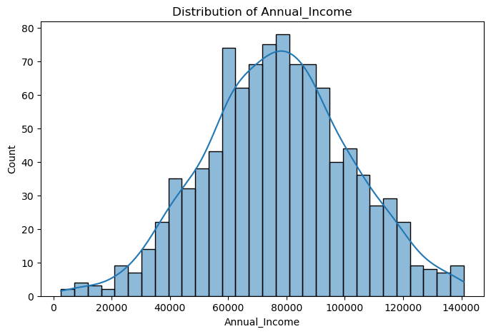

---

### Bivariate Analysis — Income vs Monthly Spend

The nearly flat regression line confirms a very weak relationship between income and spending — customers with higher incomes do not consistently spend more, making standalone income a poor predictor of spend behaviour.


---

### Loyalty vs Engagement

Neither online nor in-store visit frequency shows a meaningful correlation with loyalty score, suggesting loyalty is driven by factors beyond visit volume alone.

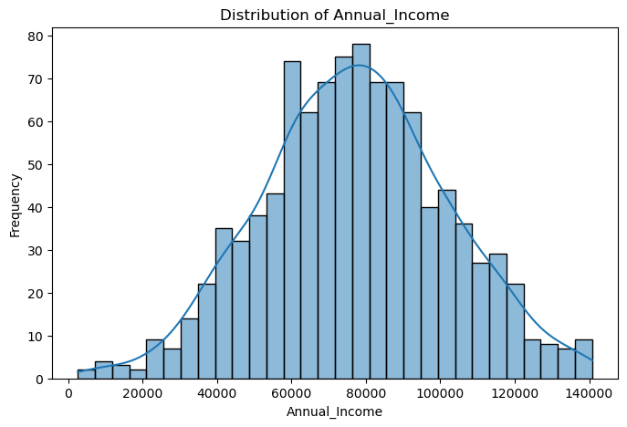

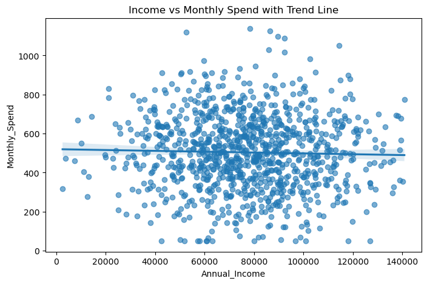

---

### Online vs Store Visit Behaviour

With a correlation coefficient of **−0.01**, online and in-store visits are virtually independent, customers who shop online frequently do not necessarily visit physical stores more often.

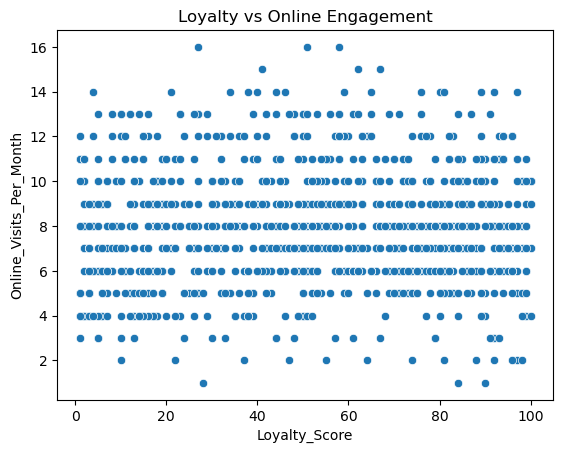

---

### Multivariate Analysis — Correlation Heatmap

Most features are largely independent of each other (values near 0.00), confirming there is no multicollinearity that would bias clustering results.

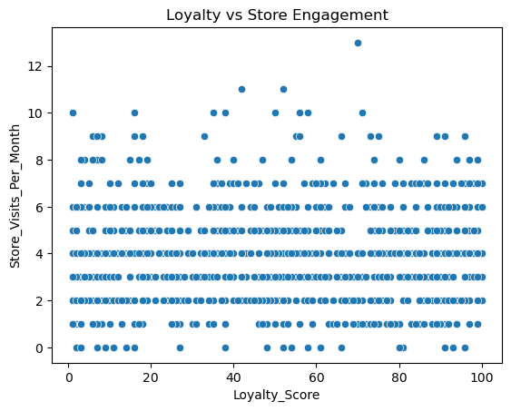

---

## ⚙️ Methodology

### Preprocessing
- Cleaned `Annual_Income` column (comma-formatted strings → float)
- Applied **StandardScaler** to normalize all features this is critical to prevent Annual Income from dominating cluster boundaries due to its large variance

### Optimal Cluster Selection — Elbow Method

The elbow curve indicates the optimal number of clusters is **K = 5**, where inertia reduction begins to flatten.

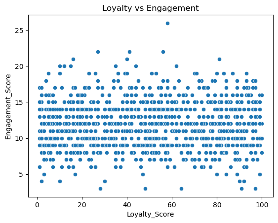

---

## 🗺️ Clustering Results

### Cluster Visualization — Income vs Monthly Spend

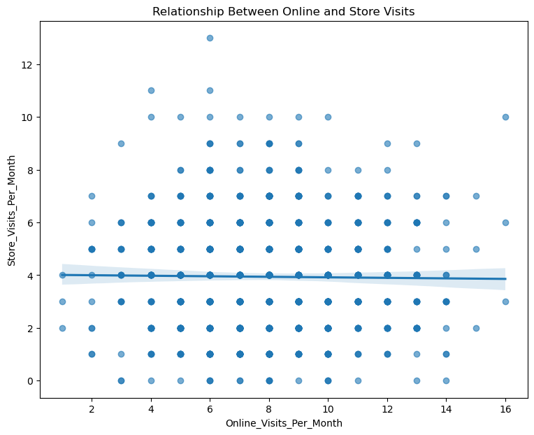

### Cluster Visualization — Income vs Loyalty Score

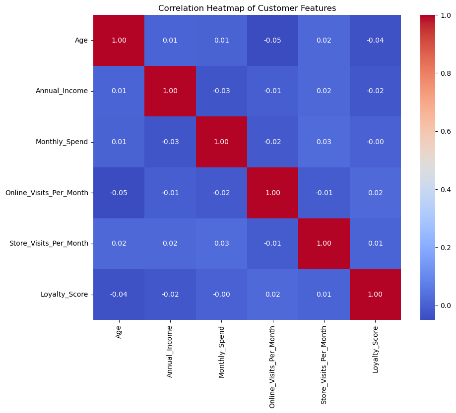

### Additional Cluster Views

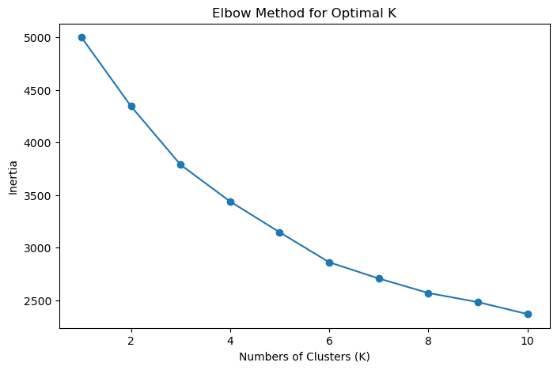
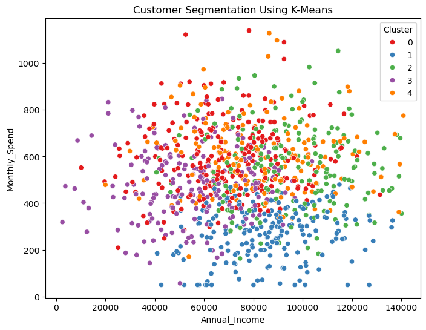
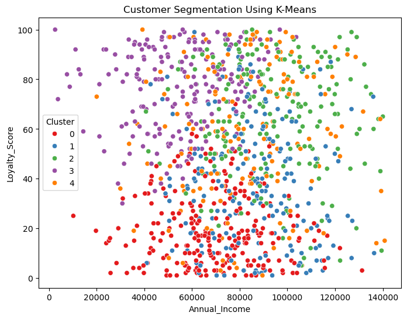
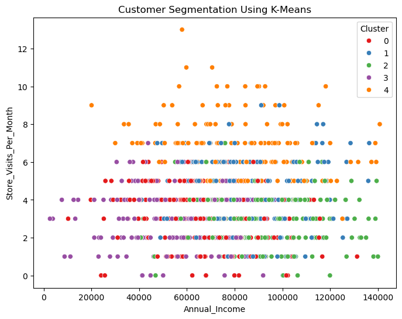

---

## 🗂️ Customer Segments

| Cluster | Business Name | Income | Spend | Loyalty | Key Risk / Opportunity |
|---|---|---|---|---|---|
| **0** | High-Value Churn Risks | High | Moderate | Low | Prone to switching; target with loyalty programs |
| **1** | Reliable Mainstream Customers | Mixed | Low–Mod | Mid–High | Stable base; upsell opportunities |
| **2** | Premium Loyal Advocates | High | High | High | Highest LTV; protect with exclusive perks |
| **3** | Aspirational Spenders | Low | Moderate–High | Mid | Budget-stretched; flexible payment plans |
| **4** | Average Spenders | Mixed | Moderate | Mid | Price sensitive; cross-sell to upgrade tier |

---

## 💡 Key Insights

- **Income and Monthly Spend** are the strongest clustering signals; visits add minimal separation without scaling
- **Cluster 2 (Premium Loyal Advocates)** drives disproportionate revenue and should receive exclusive loyalty treatment
- **Cluster 3 (Aspirational Spenders)** show strong brand affinity despite limited income, nurturing them now builds long term loyalty as income grows
- **Cluster 0 (Churn Risks)** represent high income customers the business is failing to retain targeted retention campaigns are essential.

---

## 📁 Repository Structure

```
├── MUJIDAT_FADEYI_CUSTOMER_SEGMENTATION_PROJECT.ipynb   # Full analysis notebook
├── customer_segmentation_dataset.csv                    # Dataset
└── README.md
```

---

## 👤 Author

**Mujidat Fadeyi** — Data Analyst  
[GitHub Profile](https://github.com/MjDAnalyst/MjDAnalyst)
